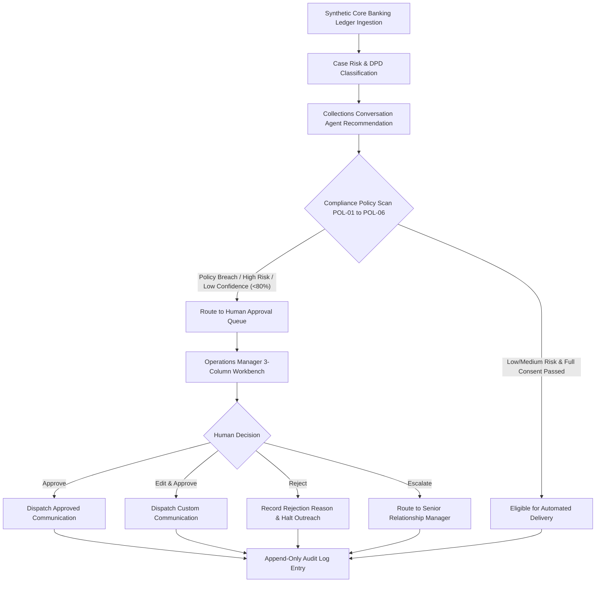

# End-to-End Operational Workflow Map

```mermaid
flowchart TD
    A[Synthetic Core Banking Ledger Ingestion] --> B[Case Risk & DPD Classification]
    B --> C[Collections Conversation Agent Recommendation]
    C --> D{Compliance Policy Scan POL-01 to POL-06}
    
    D -- Policy Breach / High Risk / Low Confidence (<80%) --> E[Route to Human Approval Queue]
    D -- Low/Medium Risk & Full Consent Passed --> F[Eligible for Automated Delivery]
    
    E --> G[Operations Manager 3-Column Workbench]
    G --> H{Human Decision}
    
    H -- Approve --> I[Dispatch Approved Communication]
    H -- Edit & Approve --> J[Dispatch Custom Communication]
    H -- Reject --> K[Record Rejection Reason & Halt Outreach]
    H -- Escalate --> L[Route to Senior Relationship Manager]
    
    I --> M[Append-Only Audit Log Entry]
    J --> M
    K --> M
    L --> M
    F --> M
```
